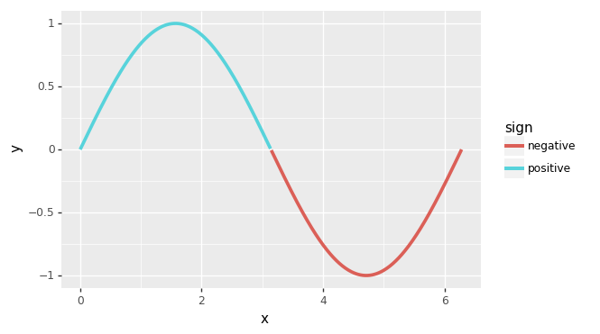

#######
plydata
#######

=========================    =======================
Latest Release               |release|_
License                      |license|_
Build Status                 |buildstatus|_
Coverage                     |coverage|_
Documentation (Dev)          |documentation|_
Documentation (Release)      |documentation_stable|_
=========================    =======================

plydata is a library that provides a grammar for data manipulation.
The grammar consists of verbs that can be applied to pandas
dataframes or database tables. It is based on the R packages
`dplyr`_, `tidyr`_ and `forcats`_. plydata uses the ``>>`` operator
as a pipe symbol, alternatively there is the ``ply(data, *verbs)``
function that you can use instead of ``>>``.

At present the only supported data store is the *pandas* dataframe.
We expect to support *sqlite* and maybe *postgresql* and *mysql*.

Installation
============
plydata **only** supports Python 3.

**Official version**

.. code-block:: console

   $ pip install plydata

**Development version**

.. code-block:: console

   $ pip install git+https://github.com/has2k1/plydata.git@master

Example
-------

.. code-block:: python

    import pandas as pd
    import numpy as np
    from plydata import define, query, if_else, ply

    # NOTE: query is the equivalent of dplyr's filter but with
    #      slightly different python syntax  for the expressions

    df = pd.DataFrame({
        'x': [0, 1, 2, 3],
        'y': ['zero', 'one', 'two', 'three']})

    df >> define(z='x')
    """
       x      y  z
    0  0   zero  0
    1  1    one  1
    2  2    two  2
    3  3  three  3
    """

    df >> define(z=if_else('x > 1', 1, 0))
    """
       x      y  z
    0  0   zero  0
    1  1    one  0
    2  2    two  1
    3  3  three  1
    """

    # You can pass the dataframe as the # first argument
    query(df, 'x > 1')  # same as `df >> query('x > 1')`
    """
       x      y
    2  2    two
    3  3  three
    """

    # You can use the ply function instead of the >> operator
    ply(df,
        define(z=if_else('x > 1', 1, 0)),
        query('z == 1')
    )
    """
        x      y  z
     2  2    two  1
     3  3  three  1
    """

    # The >>= operator can be used to modify the dataframe
    # if there is a single operation
    df >>= define(two_x='2*x')
    df
    """
        x      y  two_x
     0  0   zero      0
     1  1    one      2
     2  2    two      4
     3  3  three      6
    """

    # df >>= define(two_x='2*x') >> define(three_x='3*x')
    # is two operations and does not work

plydata piping works with `plotnine`_.

.. code-block:: python

    from plotnine import ggplot, aes, geom_line

    df = pd.DataFrame({'x': np.linspace(0, 2*np.pi, 500)})
    (df
     >> define(y='np.sin(x)')
     >> define(sign=if_else('y >= 0', '"positive"', '"negative"'))
     >> (ggplot(aes('x', 'y'))
         + geom_line(aes(color='sign'), size=1.5))
     )

What about dplython or pandas-ply?
----------------------------------

`dplython`_ and `pandas-ply`_ are two other packages that have a similar
objective to plydata. The big difference is plydata does not use
a placeholder variable (`X`) as a stand-in for the dataframe. For example:

.. code-block:: python

    diamonds >> select(X.carat, X.cut, X.price)  # dplython

    diamonds >> select('carat', 'cut', 'price')  # plydata
    select(diamonds, 'carat', 'cut', 'price')    # plydata

For more, see the documentation_.

.. |release| image:: https://img.shields.io/pypi/v/plydata.svg
.. _release: https://pypi.python.org/pypi/plydata

.. |license| image:: https://img.shields.io/pypi/l/plydata.svg
.. _license: https://pypi.python.org/pypi/plydata

.. |buildstatus| image:: https://github.com/has2k1/plydata/workflows/build/badge.svg?branch=master
.. _buildstatus: https://github.com/has2k1/plydata/actions?query=branch%3Amaster+workflow%3A%22build%22

.. |coverage| image:: https://codecov.io /github/has2k1/plydata/coverage.svg?branch=master
.. _coverage: https://codecov.io/github/has2k1/plydata?branch=master

.. |documentation| image:: https://readthedocs.org/projects/plydata/badge/?version=latest
.. _documentation: https://plydata.readthedocs.io/en/latest/

.. |documentation_stable| image:: https://readthedocs.org/projects/plydata/badge/?version=stable
.. _documentation_stable: https://plydata.readthedocs.io/en/stable/

.. _dplyr: https://github.com/tidyverse/dplyr
.. _tidyr: https://github.com/tidyverse/tidyr
.. _forcats: https://github.com/tidyverse/forcats
.. _pandas-ply: https://github.com/coursera/pandas-ply
.. _dplython: https://github.com/dodger487/dplython
.. _plotnine: https://plotnine.readthedocs.io/en/stable/
